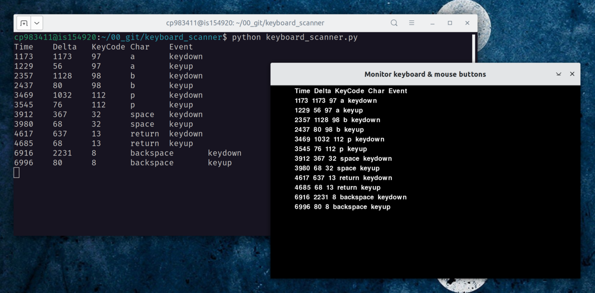

simple HID (keyoard and mouse) event monitor
============================================

`Time-stamp: <2024-12-11 08:19:55 christophe@pallier.org>`




Usage:

Go version
```
keyboard_scanner > events.tsv
```

Python version
```
python keyboard_scanner.py > events.tsv
```

The first column is the time in ms since the start, the second column is the time difference between between the current event and the previous one.

Installation:

 * The python script requires python3 and the `pygame` module (`pip install pygame`).
 
 * The go version requires the SDL2 and SDL2_ttf libraries. The binary provided in the golang folder was compiled under Ubuntu 22.04. You can generate an executable for your system  if you have go installed (<http://go.dev>) and by typing `go build keyboard_scanner`

